# Kolo Documentation

Welcome to the Kolo library documentation. This directory contains comprehensive guides and references for using the Kolo library to convert between different LLM providers.

## Documentation Structure

### 📖 [Usage Guide](usage-guide.md)
Complete guide on how to use the Kolo library, including:
- Getting started with basic examples
- Bidirectional conversion
- Provider discovery
- Dynamic provider creation
- Streaming support
- Error handling
- Advanced examples (not that advanced, just examples)


## Quick Start

1. **Add Dependencies**
   ```kotlin
   dependencies {
       implementation("com.fatihcure.kolo:providers:1.0.0")
       implementation("com.fatihcure.kolo:normalizers:1.0.0")
       implementation("com.fatihcure.kolo:transformers:1.0.0")
   }
   ```

2. **Basic Usage**
   ```kotlin
   import com.fatihcure.kolo.providers.KoloProvider
   import com.fatihcure.kolo.normalizers.openai.OpenAIRequest
   import com.fatihcure.kolo.normalizers.anthropic.AnthropicRequest

   val provider = KoloProvider()
   val kolo = provider.createKolo<OpenAIRequest, AnthropicRequest>()
   val converted = kolo.convertRequest(openAIRequest)
   ```

3. **Bidirectional Conversion**
   ```kotlin
   val bidirectionalKolo = provider.createBidirectionalKolo<OpenAIRequest, AnthropicRequest>()
   val converted = bidirectionalKolo.convertRequest(openAIRequest)
   val backToOriginal = bidirectionalKolo.convertResponse(anthropicResponse)
   ```

## Key Features

- **🔄 Universal Conversion**: Convert between any supported LLM providers
- **↔️ Bidirectional Support**: Convert requests and responses in both directions
- **🔍 Discovery**: Discover available conversions at runtime
- **⚡ Performance**: Optimized for high-throughput scenarios (benchmark: we hope so...)
- **🛡️ Type Safety**: Full compile-time type safety with Kotlin generics
- **🔌 Extensible**: Easy to add custom providers and request types
- **📡 Streaming**: Support for streaming responses
- **🛠️ Error Handling**: Comprehensive error handling and recovery

## Supported Providers

Currently supported providers:
- **OpenAI**: GPT models with Chat Completions API
- **Anthropic**: Claude models with Messages API

More providers can be added by implementing the `Provider` interface.

## Architecture

Kolo uses an intermittent format approach to minimize the number of conversions needed:

```mermaid
graph TD
    A["Your Tool<br/>(OpenAI API)"] --> B["OpenAI-format request"]
    B --> C["Normalizer<br/>(OpenAI → IF)"]
    C --> D["Intermittent Format (IF)"]
    D --> E["Transformer<br/>(IF → Anthropic)"]
    E --> F["Anthropic-format request"]
    F --> G["Provider<br/>(Claude)"]
    G --> H["Anthropic response"]
    H --> I["Normalizer<br/>(Anthropic → IF)"]
    I --> J["Intermittent Format (IF)"]
    J --> K["Transformer<br/>(IF → OpenAI)"]
    K --> L["OpenAI-format response"]
    L --> A
```



This approach reduces complexity from O(N²) to O(N) conversions.

## Getting Help

- 📖 Start with the [Usage Guide](usage-guide.md) for step-by-step instructions
- 📚 Check the [API Reference](api-reference.md) for detailed method documentation
- 💡 Look at [Examples](examples.md) for working code samples
- 🐛 Report issues on the project repository

## Contributing

We welcome contributions! Please see the main project README for contribution guidelines.

## License

This project is licensed under the same terms as the main Kolo project.
